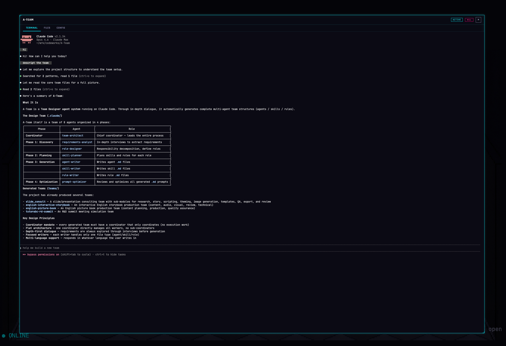
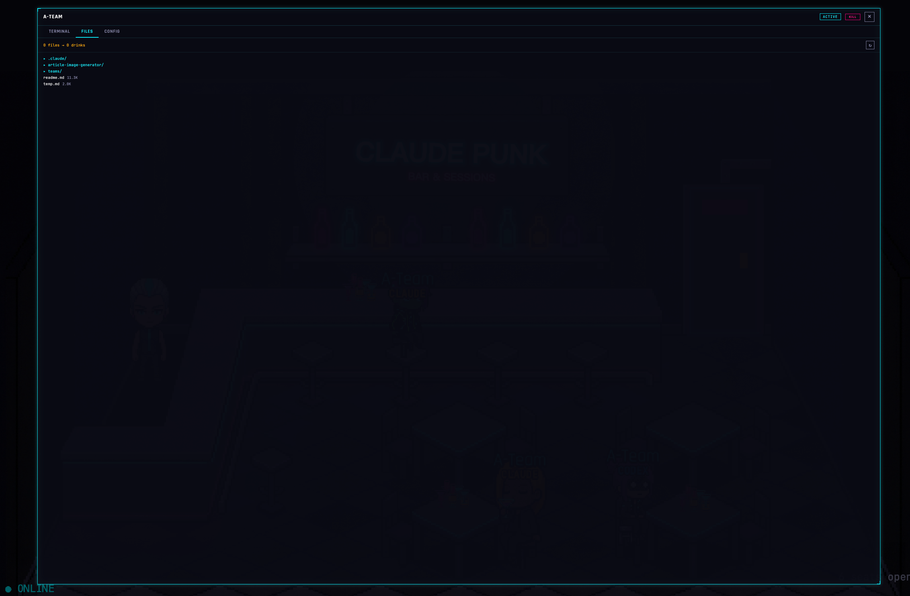
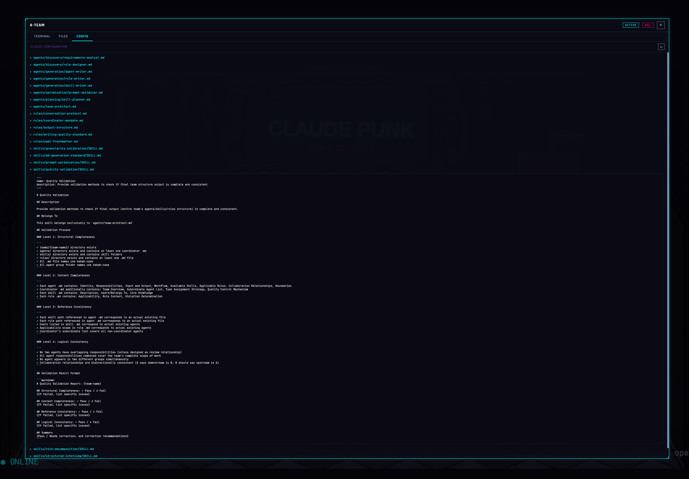

# Claude Punk
 <br>
A cyberpunk pixel-art bar game that turns AI coding agents into bar patrons. Each agent (Claude / Codex) spawns as a chibi character, walks to a seat, and works on your codebase — you can watch their terminal output in real time while they sip drinks at the bar.


**[中文版](#中文版)**

## Screenshots

<p align="center">
  <br>
  <em>overview</em>
</p>

<p align="center">
  <br>
  <em>create session</em>
</p>

<p align="center">
  <br>
  <em>warp & xTerm</em>
</p>

<p align="center">
  <br>
  <em>Files & preview </em>
</p>

<p align="center">
  <br>
  <em>Files & editor </em>
</p>

<p align="center">
  <br>
  <em>Jukebox</em>
</p>

## How It Works

1. You pick a project folder via the in-game door
2. A coding agent (Claude or Codex) spawns in a terminal session
3. The agent appears as a character in the bar, walks to a seat and starts working
4. Each character shows a hotkey label like `(a)` above their name — press the letter to open their dialog instantly
5. Click on a character (or press their hotkey) to interact: terminal, file editor, config
6. The more files in the project, the more drinks appear on the table

## Prerequisites

Before you begin, make sure you have the following installed:

### Node.js (v20+)

```bash
# macOS (Homebrew)
brew install node

# Or use nvm
nvm install 20
nvm use 20
```

### node-pty dependencies
```
sudo apt-get update
sudo apt-get install -y make python build-essential
```

### Claude Code CLI

This project spawns Claude Code as a subprocess. Install it globally:

```bash
npm install -g @anthropic-ai/claude-code
```

After installing, run `claude` once to complete the authentication flow (you'll need an Anthropic API key or a Claude Pro/Team subscription).

### OpenAI Codex CLI (optional)

If you want to use Codex agents in addition to Claude:

```bash
npm install -g @openai/codex
```

Run `codex` once to authenticate with your OpenAI API key.

## Getting Started

### 1. Clone the repo

```bash
git clone <repo-url>
cd claude-punk
```

### 2. Install backend dependencies

```bash
cd backend
npm install
```

> **Note:** `node-pty` is a native module and requires build tools. On macOS you need Xcode Command Line Tools (`xcode-select --install`). On Linux you need `build-essential` and `python3`.

### 3. Install frontend dependencies

```bash
cd ../frontend
npm install
```

### 4. Start the backend

```bash
cd ../backend
npm run dev
```

The backend starts on `http://127.0.0.1:3000`. You should see:

```
[Claude Punk] Backend running on http://127.0.0.1:3000
[Claude Punk] WebSocket at ws://127.0.0.1:3000/ws
```

### 5. Start the frontend (in a new terminal)

```bash
cd frontend
npm run dev
```

The frontend starts on `http://localhost:5173`. Open it in your browser.

Vite automatically proxies `/ws` and `/api` requests to the backend, so everything works through a single URL.

## Usage

1. Open `http://localhost:5173` in your browser
2. Click the **door** on the right side of the bar to open the folder picker
3. Select a project directory — a new agent session spawns
4. The character walks from the door to an empty seat, with a hotkey label `(a)` above their name
5. Press the hotkey letter (e.g. `a`) to open the dialog, or click on the character directly
6. The dialog panel has 3 tabs:
   - **Terminal** — live xterm.js terminal with a **File Warp** sidebar on the left. Click any file or folder name in the sidebar to insert its path into the terminal.
   - **Files** — split view with a file tree sidebar (left) and a **Monaco code editor + preview** pane (right). Click a file to open it. Markdown, HTML, and SVG files open in rendered preview by default — toggle the `CODE` button to see source. Toggle `READ-ONLY` to `EDITING` mode and hit `SAVE` to write changes back to disk.
   - **Config** — `.claude/` configuration files
7. Press `Ctrl+`` ` to close the dialog (works even when the terminal has focus), or click the X button

### Jukebox

Click the **jukebox** sprite on the left side of the bar to open the music player. Upload your own audio files and they'll play as background music while your agents work.

- **Upload** — click `+ Upload Tracks` to add audio files (mp3, wav, ogg, etc.) from your computer
- **Playlist** — click a track name to play it, reorder with the arrow buttons, or remove with the X button
- **Controls** — play/pause, skip to next, adjust volume, and toggle loop mode (ALL tracks or SINGLE track repeat)
- **Persistence** — your playlist is saved in the browser's IndexedDB, so tracks survive page reloads
- **Background music** — the bar's ambient background music automatically pauses when the jukebox plays and resumes when it stops
- The jukebox sprite shows an animated equalizer while music is playing

### Bar Tab (Cost Dashboard)

A neon "BAR TAB" menu board is displayed near the bartender, showing estimated API token usage and cost for each active agent at a glance.

- Each row shows the agent's hotkey letter, token count (e.g. `12.4K`), and estimated cost (e.g. `$2.40`)
- Click a row to open that agent's dialog panel
- A **TOTAL** row at the bottom sums up all active sessions
- Cost colors shift from green (< $1) to amber (< $5) to red ($5+)
- Each character also has a small **cost price tag** floating near their drink area
- Cost data is estimated from terminal output using a hybrid approach:
  - Parses Claude CLI cost output when available (accurate)
  - Falls back to character-count heuristic (~4 chars/token) when not
- Cost data persists in localStorage and auto-expires after 24 hours

### Speech Bubbles

Each character shows a pixel-art speech bubble above their head summarizing what the agent is currently doing.

- Bubbles auto-detect activity from terminal output using pattern matching (e.g. `Reading main.js`, `Running cmd...`, `Searching...`, `Committed abc1234`)
- Recognized patterns include: file read/write/edit, bash commands, search, build/test, git operations, npm commands, and more
- When no pattern matches but output is flowing, a typing indicator (`...`) animates
- Bubbles fade out after 5 seconds of inactivity and fully hide after 8 seconds
- Summary text is capped at 20 characters for a clean look
- Styled with the cyberpunk color palette: dark panel background with neon cyan border

## Keyboard Shortcuts

| Shortcut | Context | Action |
|----------|---------|--------|
| `Ctrl+`` ` | Anywhere | Close any open overlay (dialog, folder picker, jukebox) |
| `Escape` | When not focused in terminal | Close current overlay |
| `a` - `z` | Bar scene (no overlay open) | Open dialog for the patron with that hotkey letter |

- Hotkey letters are assigned in order (`a`, `b`, `c`...) as patrons enter the bar
- When a session terminates, its letter is freed and recycled for the next patron
- The assigned letter appears as `(a) label` above each character's head

## Project Structure

```
claude-punk/
├── backend/                # Node.js backend
│   ├── server.js           # Single-file entry point (Express + WebSocket + PTY)
│   └── package.json
├── frontend/               # Phaser.js + Vite frontend
│   ├── src/
│   │   ├── main.js         # Phaser game bootstrap
│   │   ├── scenes/         # Game scenes (BarScene)
│   │   ├── entities/       # Character, Bartender, DrinkManager, CostDashboard, SpeechBubble
│   │   ├── managers/       # HotkeyManager (keyboard shortcuts)
│   │   ├── ui/             # HTML/CSS overlay panels
│   │   │   ├── DialogBox.js
│   │   │   ├── TerminalTab.js
│   │   │   ├── FilesTab.js
│   │   │   ├── FileEditor.js      # Monaco editor + rich preview
│   │   │   ├── FileWarpPanel.js   # Terminal sidebar file tree
│   │   │   ├── FolderPicker.js
│   │   │   ├── Jukebox.js
│   │   │   └── ClaudeConfigTab.js
│   │   ├── services/       # WebSocket client, audio
│   │   ├── config/         # Game constants and configuration
│   │   └── styles/         # CSS files
│   ├── index.html
│   └── vite.config.js
└── assets/                 # Game art (sprites, backgrounds)
```

## Tech Stack

| Layer | Technology |
|-------|-----------|
| Game engine | Phaser 3 (1920x1080, pixel-perfect scaling) |
| Terminal UI | xterm.js |
| Code editor | Monaco Editor |
| Markdown preview | marked |
| Frontend build | Vite |
| Backend runtime | Node.js (ES modules) |
| HTTP server | Express |
| WebSocket | ws (raw WebSocket, JSON envelope protocol) |
| PTY management | node-pty |
| File watching | chokidar |

## Configuration

The backend has a `CONFIG` object at the top of `server.js` with tunable values:

| Variable | Default | Description |
|----------|---------|-------------|
| `PORT` | `3000` | Backend port (env var) |
| `AUTO_RUN_CLAUDE` | `true` | Auto-start the agent when a session is created |
| `maxSessions` | `16` | Maximum concurrent agent sessions |
| `fileCountRatio` | `20` | Files per drink (`drinkCount = floor(fileCount / 20)`) |

## Troubleshooting

**`node-pty` fails to install**
Make sure you have native build tools: `xcode-select --install` on macOS, or `sudo apt install build-essential python3` on Ubuntu/Debian.

**"claude: command not found" when a session starts**
Install the Claude CLI globally: `npm install -g @anthropic-ai/claude-code`, then run `claude` once to authenticate.

**WebSocket connection fails**
Make sure the backend is running on port 3000 before starting the frontend. Vite proxies WebSocket traffic to the backend.

**Port already in use**
Kill the existing process or change the port: `PORT=3001 node server.js` (and update `vite.config.js` proxy target accordingly).

## Dev Team
  - dev team agent created by [A-Team](https://github.com/chemistrywow31/A-Team) (Claude Code multi-agent system for team design)

---

# 中文版

一款賽博龐克像素風酒吧遊戲，將 AI 程式助手變成酒吧裡的客人。每個 Agent（Claude / Codex）會以 Q 版角色登場，走到座位上開始處理你的程式碼 —— 你可以即時觀看他們的終端機輸出，同時他們在吧台邊喝著小酒。

**[English Version](#claude-punk)**

## 運作方式

1. 透過遊戲中的門選擇專案資料夾
2. 一個程式 Agent（Claude 或 Codex）在終端機 session 中啟動
3. 該 Agent 以角色出現在酒吧裡，走到座位上開始工作
4. 每個角色名字上方會顯示快捷鍵標籤，如 `(a)` —— 按下對應字母即可立即開啟對話面板
5. 點擊角色（或按下快捷鍵）進行互動：終端機、檔案編輯器、設定
6. 專案中的檔案越多，桌上出現的飲料就越多

## 前置需求

### Node.js (v20+)

```bash
# macOS (Homebrew)
brew install node

# 或使用 nvm
nvm install 20
nvm use 20
```

### node-pty 相依套件
```
sudo apt-get update
sudo apt-get install -y make python build-essential
```

### Claude Code CLI

本專案以子程序方式啟動 Claude Code，需全域安裝：

```bash
npm install -g @anthropic-ai/claude-code
```

安裝後執行一次 `claude` 完成認證流程（需要 Anthropic API Key 或 Claude Pro/Team 訂閱）。

### OpenAI Codex CLI（選用）

如果你也想使用 Codex Agent：

```bash
npm install -g @openai/codex
```

執行一次 `codex` 以你的 OpenAI API Key 進行認證。

## 快速開始

### 1. Clone 專案

```bash
git clone <repo-url>
cd claude-punk
```

### 2. 安裝後端相依套件

```bash
cd backend
npm install
```

> **注意：** `node-pty` 是原生模組，需要編譯工具。macOS 需要 Xcode Command Line Tools（`xcode-select --install`），Linux 需要 `build-essential` 和 `python3`。

### 3. 安裝前端相依套件

```bash
cd ../frontend
npm install
```

### 4. 啟動後端

```bash
cd ../backend
npm run dev
```

後端啟動於 `http://127.0.0.1:3000`，你會看到：

```
[Claude Punk] Backend running on http://127.0.0.1:3000
[Claude Punk] WebSocket at ws://127.0.0.1:3000/ws
```

### 5. 啟動前端（開新終端機）

```bash
cd frontend
npm run dev
```

前端啟動於 `http://localhost:5173`，在瀏覽器中開啟即可。

Vite 會自動將 `/ws` 和 `/api` 請求代理到後端，所以只需透過一個 URL 操作。

## 使用方式

1. 在瀏覽器中開啟 `http://localhost:5173`
2. 點擊酒吧右側的**門**開啟資料夾選擇器
3. 選擇專案目錄 —— 一個新的 Agent session 會啟動
4. 角色從門走到空座位，名字上方顯示快捷鍵標籤 `(a)`
5. 按下快捷鍵字母（如 `a`）開啟對話面板，或直接點擊角色
6. 對話面板有 3 個分頁：
   - **Terminal** —— 即時 xterm.js 終端機，左側有 **File Warp** 側欄。點擊側欄中的檔案或資料夾名稱，即可將路徑插入終端機。
   - **Files** —— 左側檔案樹 + 右側 **Monaco 程式碼編輯器 + 預覽**。點擊檔案即可開啟。Markdown、HTML、SVG 檔案預設以渲染預覽開啟 —— 點 `CODE` 按鈕切換原始碼。切換 `READ-ONLY` 為 `EDITING` 模式後按 `SAVE` 即可寫回磁碟。
   - **Config** —— `.claude/` 設定檔
7. 按 `Ctrl+`` ` 關閉對話面板（即使終端機獲得焦點時也有效），或點擊 X 按鈕

### 點唱機（Jukebox）

點擊酒吧左側的**點唱機**精靈圖開啟音樂播放器。上傳你自己的音樂檔案，在 Agent 工作時當作背景音樂播放。

- **上傳** —— 點擊 `+ Upload Tracks` 從電腦添加音訊檔案（mp3、wav、ogg 等）
- **播放清單** —— 點擊曲目名稱播放，用箭頭按鈕調整順序，或用 X 按鈕移除
- **控制項** —— 播放/暫停、下一首、調整音量、切換循環模式（全部循環 或 單曲循環）
- **持久化** —— 播放清單儲存在瀏覽器的 IndexedDB 中，重新整理頁面後仍然保留
- **背景音樂** —— 點唱機播放時，酒吧的環境背景音樂會自動暫停；點唱機停止後自動恢復
- 音樂播放時，點唱機精靈圖會顯示動態等化器動畫

### 吧台帳單（Bar Tab）

調酒師旁邊有一塊霓虹風格的「BAR TAB」菜單看板，一目了然顯示每個 Agent 的預估 API Token 用量與費用。

- 每行顯示 Agent 的快捷鍵字母、Token 數量（如 `12.4K`）和預估費用（如 `$2.40`）
- 點擊任一行即可開啟該 Agent 的對話面板
- 底部有 **TOTAL** 列，加總所有活躍 session 的費用
- 費用顏色隨金額變化：綠色（< $1）→ 琥珀色（< $5）→ 紅色（$5+）
- 每個角色的飲料區域旁也有一個小型**費用標籤**浮動顯示
- 費用估算採用混合策略：
  - 優先解析 Claude CLI 輸出的費用資訊（精確）
  - 無法解析時使用字元數推估（約 4 字元/token）
- 費用資料儲存於 localStorage，24 小時後自動過期

### 對話氣泡（Speech Bubbles）

每個角色頭上會顯示像素風格的對話氣泡，簡要描述 Agent 當前正在做什麼。

- 氣泡透過模式比對自動偵測終端機輸出中的活動（如 `Reading main.js`、`Running cmd...`、`Searching...`、`Committed abc1234`）
- 可識別的模式包括：檔案讀寫/編輯、bash 指令、搜尋、建置/測試、git 操作、npm 指令等
- 當無法匹配模式但有輸出時，會顯示打字指示器（`...`）動畫
- 無活動 5 秒後氣泡開始淡出，8 秒後完全隱藏
- 摘要文字限制 20 字元以保持整潔
- 風格遵循賽博龐克配色：深色面板背景搭配霓虹青色邊框

## 快捷鍵

| 快捷鍵 | 情境 | 動作 |
|--------|------|------|
| `Ctrl+`` ` | 任何時候 | 關閉任何開啟的覆蓋層（對話面板、資料夾選擇器、點唱機） |
| `Escape` | 非終端機焦點時 | 關閉當前覆蓋層 |
| `a` - `z` | 酒吧場景（無覆蓋層開啟時） | 開啟對應快捷鍵字母的客人對話面板 |

- 快捷鍵字母按客人進入酒吧的順序分配（`a`、`b`、`c`...）
- 當 session 結束時，字母會被釋放並回收給下一位客人
- 分配的字母會以 `(a) label` 的形式顯示在角色頭上

## 專案結構

```
claude-punk/
├── backend/                # Node.js 後端
│   ├── server.js           # 單檔入口（Express + WebSocket + PTY）
│   └── package.json
├── frontend/               # Phaser.js + Vite 前端
│   ├── src/
│   │   ├── main.js         # Phaser 遊戲啟動
│   │   ├── scenes/         # 遊戲場景（BarScene）
│   │   ├── entities/       # Character、Bartender、DrinkManager、CostDashboard、SpeechBubble
│   │   ├── managers/       # HotkeyManager（鍵盤快捷鍵）
│   │   ├── ui/             # HTML/CSS 覆蓋面板
│   │   │   ├── DialogBox.js
│   │   │   ├── TerminalTab.js
│   │   │   ├── FilesTab.js
│   │   │   ├── FileEditor.js      # Monaco 編輯器 + 豐富預覽
│   │   │   ├── FileWarpPanel.js   # 終端機側欄檔案樹
│   │   │   ├── FolderPicker.js
│   │   │   ├── Jukebox.js
│   │   │   └── ClaudeConfigTab.js
│   │   ├── services/       # WebSocket 客戶端、音訊
│   │   ├── config/         # 遊戲常數與設定
│   │   └── styles/         # CSS 檔案
│   ├── index.html
│   └── vite.config.js
└── assets/                 # 遊戲美術（精靈圖、背景）
```

## 技術棧

| 層級 | 技術 |
|------|------|
| 遊戲引擎 | Phaser 3（1920x1080，像素完美縮放） |
| 終端機 UI | xterm.js |
| 程式碼編輯器 | Monaco Editor |
| Markdown 預覽 | marked |
| 前端建置 | Vite |
| 後端執行環境 | Node.js（ES modules） |
| HTTP 伺服器 | Express |
| WebSocket | ws（原生 WebSocket，JSON 封包協議） |
| PTY 管理 | node-pty |
| 檔案監控 | chokidar |

## 設定

後端在 `server.js` 頂部有一個 `CONFIG` 物件，可調整以下參數：

| 變數 | 預設值 | 說明 |
|------|--------|------|
| `PORT` | `3000` | 後端埠號（環境變數） |
| `AUTO_RUN_CLAUDE` | `true` | 建立 session 時自動啟動 Agent |
| `maxSessions` | `16` | 最大同時 Agent session 數 |
| `fileCountRatio` | `20` | 每幾個檔案一杯飲料（`drinkCount = floor(fileCount / 20)`） |

## 疑難排解

**`node-pty` 安裝失敗**
確保有原生編譯工具：macOS 執行 `xcode-select --install`，Ubuntu/Debian 執行 `sudo apt install build-essential python3`。

**啟動 session 時出現 "claude: command not found"**
全域安裝 Claude CLI：`npm install -g @anthropic-ai/claude-code`，然後執行一次 `claude` 進行認證。

**WebSocket 連線失敗**
確保在啟動前端之前後端已在 port 3000 上運行。Vite 會將 WebSocket 流量代理到後端。

**Port 已被佔用**
終止現有程序或更換埠號：`PORT=3001 node server.js`（並相應更新 `vite.config.js` 的代理目標）。

## 開發團隊
  - 開發團隊 Agent 由 [A-Team](https://github.com/chemistrywow31/A-Team) 建立（Claude Code 多 Agent 團隊設計系統）
